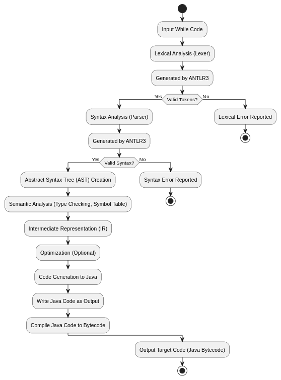
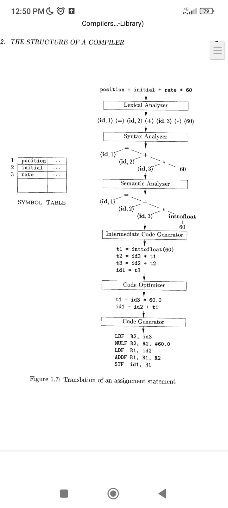

# CREATE A COMPILER FOR WHILE LANGUAGE

## EXAMPLE CODE 
```code
function main : read X, Y %
    Z := (cons X Y);
    if Z then
        W := (hd Z)
    else
        W := nil
    fi;
    foreach A in Z do
        B := (hd A)
    od
%
write W
```


## Workflow

Here is a workflow of the work




### Example

